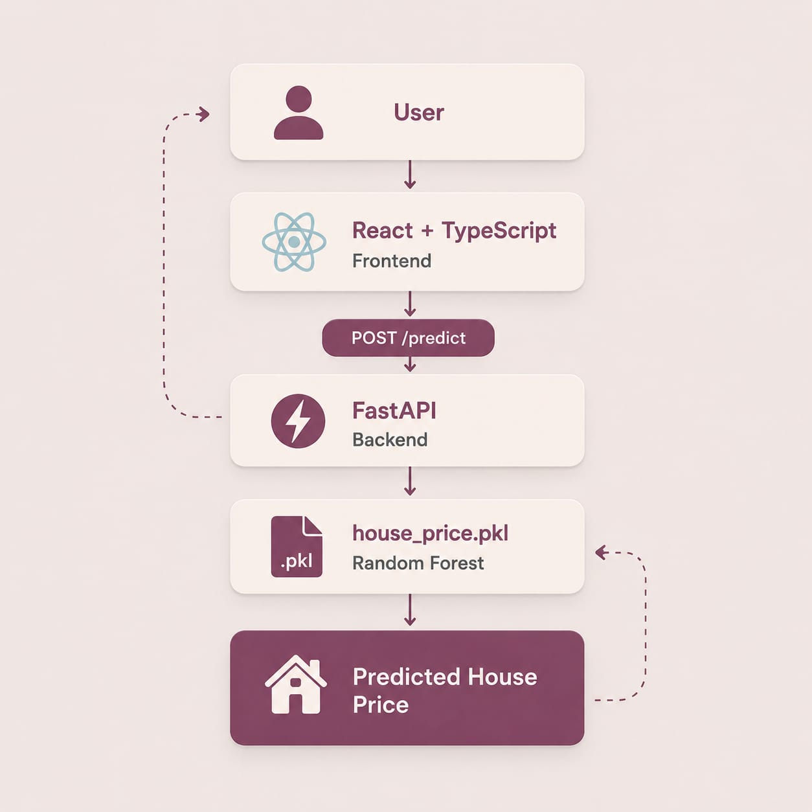
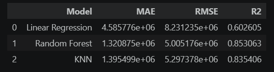
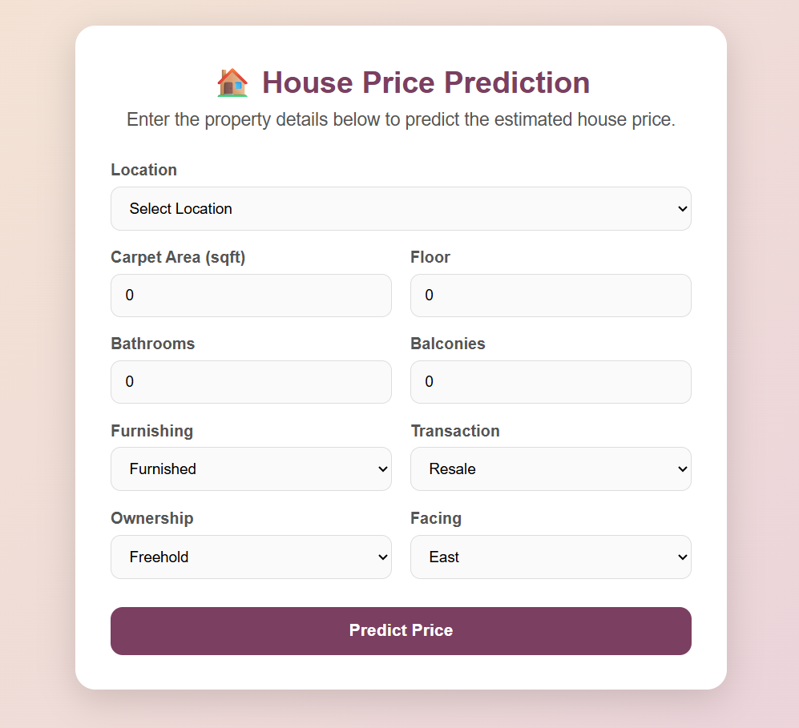
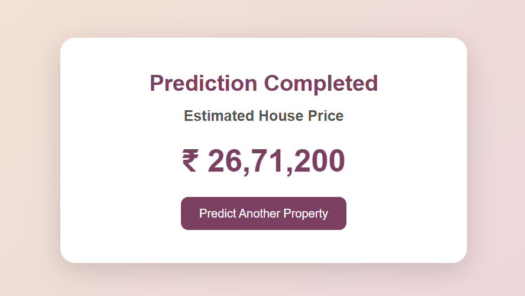

#  House Price Prediction

A full-stack machine learning application that predicts house prices based on property features such as location, area, floor, bathrooms, furnishing, transaction type, ownership, and facing.

The project includes a machine learning notebook, a FastAPI backend, and a React + TypeScript frontend.

---

##  Architecture



**Flow:** React Frontend → FastAPI Backend → Random Forest Model → Predicted Price

---

##  Tech Stack

| Part             | Technologies                        |
| ---------------- | ----------------------------------- |
| Machine Learning | Python, Pandas, NumPy, Scikit-learn |
| Backend          | FastAPI, Uvicorn, Pydantic          |
| Frontend         | React, TypeScript, Vite, CSS        |
| Testing          | Pytest                              |
| Version Control  | Git, GitHub                         |

---

##  Project Structure

```text
House-Price-Prediction/
│
├── backend/
│   ├── app/
│   ├── models/
│   │   └── house_price.pkl
│   ├── tests/
│   └── requirements.txt
│
├── frontend/
│   ├── public/
│   │   └── locations.json
│   ├── src/
│   ├── .env.example
│   └── package.json
│
├── notebooks/
│   └── house_price_model.ipynb
│
├── screenshots/
│   ├── architecture.jpeg
│   ├── home.png
│   └── result.png
│
├── .gitignore
└── README.md
```

---

---

## Dataset

The project uses the **House Price** dataset from Kaggle.

**Dataset:**  
https://www.kaggle.com/datasets/juhibhojani/house-price

### Download Instructions

1. Open the Kaggle dataset link.
2. Download the dataset.
3. Place the CSV file locally in the project.
4. Make sure it is named:

```text
house_prices.csv
```

The raw CSV is excluded from GitHub using `.gitignore`.

### Trained Model

The trained Random Forest model is provided separately because the file size is larger than GitHub's recommended file size limit.

**Download the trained model:**
https://drive.google.com/file/d/1wCqHGKXj6QaA4c4GZmM610FgtLplS8W4/view?usp=sharing

After downloading, place the file here:

```text
backend/models/house_price.pkl
```

---

## Model Performance



**Random Forest** was selected as the final model because it achieved the best overall performance.

---

## Backend Setup

Open a terminal in the project root:

```bash
cd backend
```

Create a virtual environment:

### Windows

```powershell
python -m venv .venv
.venv\Scripts\activate
```

Install the required packages:

```powershell
pip install -r requirements.txt
```

```

Run the FastAPI server:

```powershell
uvicorn app.main:app --reload --port 8000
```

Backend URL:

```text
http://localhost:8000
```

API documentation:

```text
http://localhost:8000/docs
```

---

  Frontend Setup

Open another terminal:

```bash
cd frontend
```

Install dependencies:

```bash
npm install
```

Create a `.env` file inside the `frontend` folder.

### Environment Variables

| Variable            | Description         | Example                 |
| ------------------- | ------------------- | ----------------------- |
| `VITE_API_BASE_URL` | FastAPI backend URL | `http://localhost:8000` |

Example `.env`:

```env
VITE_API_BASE_URL=http://localhost:8000
```

Start the frontend:

```bash
npm run dev
```

Frontend URL:

```text
http://localhost:5173
```

---

##  API Reference

### `POST /predict`

Returns the estimated house price based on the provided property information.

### Request Example

```bash
curl -X POST "http://localhost:8000/predict" ^
-H "Content-Type: application/json" ^
-d "{\"location\":\"Whitefield\",\"carpet_area_clean\":1200,\"floor_clean\":3,\"Bathroom_clean\":2,\"Balcony_clean\":1,\"Furnishing\":\"Semi-Furnished\",\"Transaction\":\"Resale\",\"Ownership\":\"Freehold\",\"facing\":\"East\"}"
```

### Response Example

```json
{
  "predicted_price": 5265917
}
```

### Health Check

```text
GET /health
```

---

##  Testing

Run the backend tests with:

```bash
pytest
```

The tests verify the main API functionality.

---

##  User interface

### Home Page



### Prediction Result



---

##  End-to-End Demo

The application works through the following flow:

**User Input → React → FastAPI → Random Forest Model → Predicted Price**

Run both servers, open the frontend, enter the property details, and click **Predict Price**.
ظ
---

##  Notes

* The raw `house_prices.csv` dataset is not committed to GitHub.
* `node_modules`, `.venv`, `.env`, cache files, and build files are excluded from the repository.
* The trained Random Forest model is exported as `house_price.pkl`.
* The trained model file (`house_price.pkl`) is not included in the GitHub repository because its size exceeds GitHub's recommended file limit. It is generated by running the machine learning notebook.
